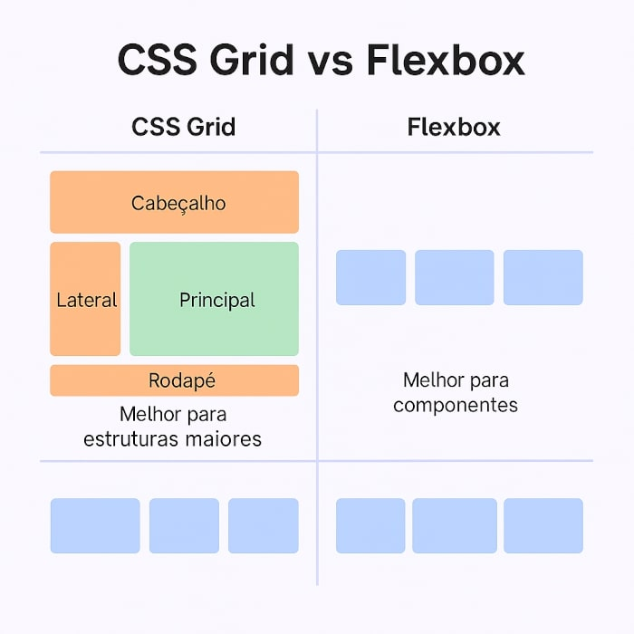

# 🧩 CSS Grid Layout

Este documento reúne os principais aprendizados sobre **CSS Grid** estudados no curso da **DevSamurai**. Ele apresenta explicações diretas, exemplos de código e comparações práticas.

---

## 📌 O que é CSS Grid?

O CSS Grid é um sistema de layout que permite distribuir elementos em linhas e colunas. Diferente do Flexbox (que é unidimensional), o Grid trabalha nos **dois eixos ao mesmo tempo**.

---

## 🤔 CSS Grid vs Flexbox

| Flexbox           | CSS Grid             |
|-------------------|----------------------|
| Unidimensional    | Bidimensional        |
| Alinha em linha ou coluna | Alinha em linha **e** coluna |
| Melhor para componentes | Melhor para estruturas maiores |

**Sim!** É possível usar os dois ao mesmo tempo para obter layouts poderosos e flexíveis.



---

## 📚 Tópicos Estudados

### `01 - Grid Template`
Definição de linhas e colunas de forma abreviada com `grid-template`.
```css
.grid {
    display: grid; /* Ativa o Grid */
    grid-template: auto auto / auto auto; /* Grid Template */
}
```
Essa declaração é o mesmo que:
```css
.grid {
grid-template-rows: auto auto;
grid-template-columns: auto auto;
}
```
Cria 2 linhas e 2 colunas com tamanhos automáticos, que se ajustam ao conteúdo.

### `02 - Grid Gap`
Controla o espaçamento entre as células da grade, tanto em linhas `row-gap: 10px` quanto em colunas `column-gap: 5px`.
```css
.grid {
    gap: 10px 5px; /* Grid Gap */
}
```

### `03 - Grid Auto Columns`
Define o tamanho das colunas geradas automaticamente.
```css
.grid {
    display: grid;
    grid-template-columns: repeat(3, 100px);
    grid-auto-columns: 100px; /* Auto Columns */
}
```

### `04 - Grid Auto Rows`
Define o tamanho das linhas geradas automaticamente.
```css
.grid {
    display: grid;
    grid-template-columns: repeat(2, 100px);
    grid-auto-rows: 100px; /* Auto Rows */
}
```

### `05 - Grid Auto Flow`
Controla o fluxo automático dos itens (linha ou coluna).
```css
.grid {
    display: grid;
    grid-template-columns: repeat(3, 200px);
    grid-auto-flow: column; /* ou row - Auto Flow */
}
```

### `06 - Grid Column`
Define onde o item começa e termina na coluna.
```css
.grid-item {
    grid-column: 2 / 5; /* Vai da coluna 2 até a 5 - Grid Column */
}
```

### `07 - Grid Row`
Define onde o item começa e termina na linha.
```css
.grid-item {
    grid-row: 1 / 6; /* Vai da linha 1 até a 6 - Grid Row */
}
```

### `08 - Grid Area`
Nomeia e posiciona áreas do grid.
```css
.grid {
    grid-template-areas: 
        "header header"
        "nav body"
        "nav footer";
} /* Grid Area */

.grid-item .header { grid-area: header; } /* Area Header */
.grid-item .nav { grid-area: nav; } /* Area Nav */
.grid-item .body { grid-area: body; } /* Area Body */
.grid-item .footer { grid-area: footer; } /* Area Footer */
```

### `09 - Responsividade`
Adapta o layout para diferentes tamanhos de tela, garantindo uma boa experiência em dispositivos móveis.
```css
@media screen and (max-width: 1024px) {
    .grid {
        grid-template-columns: 1fr !important;
        grid-template-rows: 80px 50px 1fr 80px !important;
        grid-template-areas:
          "header"
          "nav"
          "body"
          "footer" !important;
    }
}
```

## 💡 Conclusão

O CSS Grid é essencial para qualquer dev moderno que quer criar layouts profissionais e responsivos. Com esses conceitos dominados, é possível criar desde pequenas interfaces até grandes sistemas com facilidade.

## 📁 Estrutura deste repositório
```c#
📆 Grid - DevSamurai
🗂️ 01 - Grid Template
🗂️ 02 - Grid Gap
🗂️ 03 - Grid Auto Columns
🗂️ 04 - Grid Auto Rows
🗂️ 05 - Grid Auto Flow
🗂️ 06 - Grid Column
🗂️ 07 - Grid Row
🗂️ 08 - Grid Area
🗂️ 09 - Responsividade
🗋 README.md
```

##### Feito com 👨‍💻 por **Matheus Souza** - [@SouzaStack](https://github.com/SouzaStack)